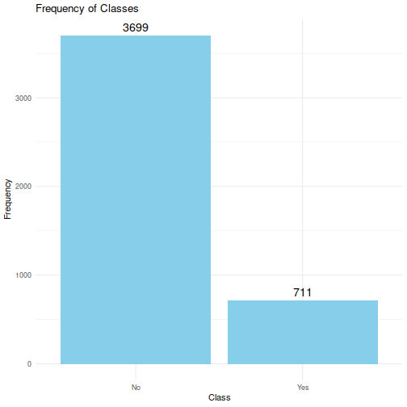
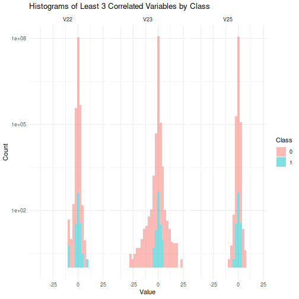
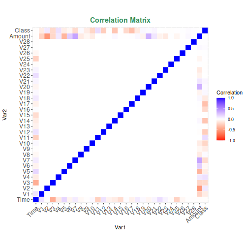
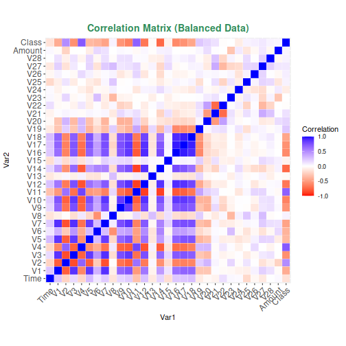

```
##    Time         V1          V2          V3          V4           V5          V6           V7           V8
## 1     0 -1.3598071 -0.07278117  2.53634674  1.37815522 -0.338320770  0.46238778  0.239598554  0.098697901
## 2     0  1.1918571  0.26615071  0.16648011  0.44815408  0.060017649 -0.08236081 -0.078802983  0.085101655
## 3     1 -1.3583541 -1.34016307  1.77320934  0.37977959 -0.503198133  1.80049938  0.791460956  0.247675787
## 4     1 -0.9662717 -0.18522601  1.79299334 -0.86329128 -0.010308880  1.24720317  0.237608940  0.377435875
## 5     2 -1.1582331  0.87773675  1.54871785  0.40303393 -0.407193377  0.09592146  0.592940745 -0.270532677
## 6     2 -0.4259659  0.96052304  1.14110934 -0.16825208  0.420986881 -0.02972755  0.476200949  0.260314333
## 7     4  1.2296576  0.14100351  0.04537077  1.20261274  0.191880989  0.27270812 -0.005159003  0.081212940
## 8     7 -0.6442694  1.41796355  1.07438038 -0.49219902  0.948934095  0.42811846  1.120631358 -3.807864239
## 9     7 -0.8942861  0.28615720 -0.11319221 -0.27152613  2.669598660  3.72181806  0.370145128  0.851084443
## 10    9 -0.3382618  1.11959338  1.04436655 -0.22218728  0.499360806 -0.24676110  0.651583206  0.069538587
## 11   10  1.4490438 -1.17633883  0.91385983 -1.37566665 -1.971383165 -0.62915214 -1.423235601  0.048455888
## 12   10  0.3849782  0.61610946 -0.87429970 -0.09401863  2.924584378  3.31702717  0.470454672  0.538247228
## 13   10  1.2499987 -1.22163681  0.38393015 -1.23489869 -1.485419474 -0.75323016 -0.689404975 -0.227487228
## 14   11  1.0693736  0.28772213  0.82861273  2.71252043 -0.178398016  0.33754373 -0.096716862  0.115981736
## 15   12 -2.7918548 -0.32777076  1.64175016  1.76747274 -0.136588446  0.80759647 -0.422911390 -1.907107476
## 16   12 -0.7524170  0.34548542  2.05732291 -1.46864330 -1.158393680 -0.07784983 -0.608581418  0.003603484
## 17   12  1.1032154 -0.04029621  1.26733209  1.28909147 -0.735997164  0.28806916 -0.586056786  0.189379714
## 18   13 -0.4369051  0.91896621  0.92459077 -0.72721905  0.915678718 -0.12786735  0.707641607  0.087962355
## 19   14 -5.4012577 -5.45014783  1.18630463  1.73623880  3.049105878 -1.76340557 -1.559737699  0.160841747
## 20   15  1.4929360 -1.02934573  0.45479473 -1.43802588 -1.555434101 -0.72096115 -1.080664130 -0.053127118
## 21   16  0.6948848 -1.36181910  1.02922104  0.83415930 -1.191208794  1.30910882 -0.878585911  0.445290128
## 22   17  0.9624961  0.32846103 -0.17147905  2.10920407  1.129565571  1.69603769  0.107711607  0.521502164
## 23   18  1.1666164  0.50212009 -0.06730031  2.26156924  0.428804195  0.08947352  0.241146580  0.138081705
## 24   18  0.2474911  0.27766563  1.18547084 -0.09260255 -1.314393979 -0.15011600 -0.946364950 -1.617935051
## 25   22 -1.9465251 -0.04490051 -0.40557007 -1.01305734  2.941967700  2.95505340 -0.063063147  0.855546309
## 26   22 -2.0742947 -0.12148180  1.32202063  0.41000751  0.295197546 -0.95953723  0.543985491 -0.104626728
## 27   23  1.1732846  0.35349788  0.28390507  1.13356332 -0.172577182 -0.91605371  0.369024845 -0.327260242
## 28   23  1.3227073 -0.17404083  0.43455503  0.57603765 -0.836758046 -0.83108341 -0.264904961 -0.220981943
## 29   23 -0.4142888  0.90543732  1.72745294  1.47347127  0.007442741 -0.20033068  0.740228319 -0.029247400
## 30   23  1.0593871 -0.17531919  1.26612964  1.18610995 -0.786001753  0.57843528 -0.767084276  0.401046149
## 31   24  1.2374290  0.06104258  0.38052588  0.76156411 -0.359770710 -0.49408415  0.006494218 -0.133862380
## 32   25  1.1140086  0.08554609  0.49370249  1.33575999 -0.300188551 -0.01075378 -0.118760015  0.188616696
##            V9         V10         V11         V12         V13         V14          V15          V16          V17
## 1   0.3637870  0.09079417 -0.55159953 -0.61780086 -0.99138985 -0.31116935  1.468176972 -0.470400525  0.207971242
## 2  -0.2554251 -0.16697441  1.61272666  1.06523531  0.48909502 -0.14377230  0.635558093  0.463917041 -0.114804663
## 3  -1.5146543  0.20764287  0.62450146  0.06608369  0.71729273 -0.16594592  2.345864949 -2.890083194  1.109969379
## 4  -1.3870241 -0.05495192 -0.22648726  0.17822823  0.50775687 -0.28792375 -0.631418118 -1.059647245 -0.684092786
## 5   0.8177393  0.75307443 -0.82284288  0.53819555  1.34585159 -1.11966983  0.175121130 -0.451449183 -0.237033239
## 6  -0.5686714 -0.37140720  1.34126198  0.35989384 -0.35809065 -0.13713370  0.517616807  0.401725896 -0.058132823
## 7   0.4649600 -0.09925432 -1.41690724 -0.15382583 -0.75106272  0.16737196  0.050143594 -0.443586798  0.002820512
## 8   0.6153747  1.24937618 -0.61946780  0.29147435  1.75796421 -1.32386522  0.686132504 -0.076126999 -1.222127345
## 9  -0.3920476 -0.41043043 -0.70511659 -0.11045226 -0.28625363  0.07435536 -0.328783050 -0.210077268 -0.499767969
## 10 -0.7367273 -0.36684564  1.01761447  0.83638957  1.00684351 -0.44352282  0.150219101  0.739452777 -0.540979922
## 11 -1.7204084  1.62665906  1.19964395 -0.67143978 -0.51394715 -0.09504505  0.230930409  0.031967467  0.253414716
## 12 -0.5588946  0.30975539 -0.25911556 -0.32614323 -0.09004672  0.36283237  0.928903661 -0.129486811 -0.809978926
## 13 -2.0940106  1.32372927  0.22766623 -0.24268200  1.20541681 -0.31763053  0.725674990 -0.815612186  0.873936448
## 14 -0.2210826  0.46023044 -0.77365693  0.32338725 -0.01107589 -0.17848518 -0.655564278 -0.199925171  0.124005415
## 15  0.7557129  1.15108699  0.84455547  0.79294395  0.37044809 -0.73497511  0.406795710 -0.303057624 -0.155868715
## 16 -0.4361670  0.74773083 -0.79398060 -0.77040673  1.04762700 -1.06660368  1.106953457  1.660113557 -0.279265373
## 17  0.7823329 -0.26797507 -0.45031128  0.93670771  0.70838041 -0.46864729  0.354574063 -0.246634656 -0.009212378
## 18 -0.6652714 -0.73797982  0.32409781  0.27719211  0.25262426 -0.29189646 -0.184520169  1.143173707 -0.928709263
## 19  1.2330897  0.34517283  0.91722987  0.97011672 -0.26656776 -0.47912993 -0.526608503  0.472004112 -0.725480945
## 20 -1.9786816  1.63807604  1.07754241 -0.63204651 -0.41695717  0.05201052 -0.042978923 -0.166432496  0.304241419
## 21 -0.4461958  0.56852074  1.01915061  1.29832870  0.42048027 -0.37265100 -0.807979513 -2.044557483  0.515663469
## 22 -1.1913111  0.72439631  1.69032992  0.40677358 -0.93642130  0.98373942  0.710910766 -0.602231772  0.402484376
## 23 -0.9891624  0.92217497  0.74478579 -0.53137725 -2.10534645  1.12687010  0.003075323  0.424424506 -0.454475292
## 24  1.5440714 -0.82988060 -0.58319953  0.52493323 -0.45337530  0.08139309  1.555204196 -1.396894893  0.783130838
## 25  0.0499669  0.57374251 -0.08125651 -0.21574500  0.04416063  0.03389776  1.190717675  0.578843475 -0.975667025
## 26  0.4756640  0.14945062 -0.85656636 -0.18052316 -0.65523293 -0.27979686 -0.211667955 -0.333320610  0.010751094
## 27 -0.2466510 -0.04613930 -0.14341853  0.97935038  1.49228544  0.10141753  0.761477545 -0.014584082 -0.511640117
## 28 -1.0714246  0.86855855 -0.64150629 -0.11131578  0.36148541  0.17194512  0.782166532 -1.355870730 -0.216935153
## 29 -0.5933920 -0.34618823 -0.01214219  0.78679632  0.63595388 -0.08632447  0.076803687 -1.405919334  0.775591738
## 30  0.6994997 -0.06473756  1.04829249  1.00561836 -0.54200158 -0.03991450 -0.218683248  0.004475682 -0.193554039
## 31  0.4388097 -0.20735805 -0.92918211  0.52710606  0.34867590 -0.15253514 -0.218385630 -0.191551818 -0.116580603
## 32  0.2056868  0.08226226  1.13355567  0.62669900 -1.49278039  0.52078789 -0.674592597 -0.529108242  0.158256198
##            V18         V19         V20          V21          V22          V23         V24         V25         V26
## 1   0.02579058  0.40399296  0.25141210 -0.018306778  0.277837576 -0.110473910  0.06692807  0.12853936 -0.18911484
## 2  -0.18336127 -0.14578304 -0.06908314 -0.225775248 -0.638671953  0.101288021 -0.33984648  0.16717040  0.12589453
## 3  -0.12135931 -2.26185710  0.52497973  0.247998153  0.771679402  0.909412262 -0.68928096 -0.32764183 -0.13909657
## 4   1.96577500 -1.23262197 -0.20803778 -0.108300452  0.005273597 -0.190320519 -1.17557533  0.64737603 -0.22192884
## 5  -0.03819479  0.80348692  0.40854236 -0.009430697  0.798278495 -0.137458080  0.14126698 -0.20600959  0.50229222
## 6   0.06865315 -0.03319379  0.08496767 -0.208253515 -0.559824796 -0.026397668 -0.37142658 -0.23279382  0.10591478
## 7  -0.61198734 -0.04557504 -0.21963255 -0.167716266 -0.270709726 -0.154103787 -0.78005542  0.75013694 -0.25723685
## 8  -0.35822157  0.32450473 -0.15674185  1.943465340 -1.015454710  0.057503530 -0.64970901 -0.41526657 -0.05163430
## 9   0.11876486  0.57032817  0.05273567 -0.073425100 -0.268091632 -0.204232670  1.01159180  0.37320468 -0.38415731
## 10  0.47667726  0.45177296  0.20371145 -0.246913937 -0.633752642 -0.120794084 -0.38504993 -0.06973305  0.09419883
## 11  0.85434381 -0.22136541 -0.38722647 -0.009301897  0.313894411  0.027740158  0.50051229  0.25136736 -0.12947795
## 12  0.35998539  0.70766383  0.12599158  0.049923686  0.238421512  0.009129869  0.99671021 -0.76731483 -0.49220830
## 13 -0.84778860 -0.68319263 -0.10275594 -0.231809239 -0.483285330  0.084667691  0.39283089  0.16113455 -0.35499004
## 14 -0.98049620 -0.98291608 -0.15319723 -0.036875532  0.074412403 -0.071407433  0.10474375  0.54826473  0.10409415
## 15  0.77826546  2.22186801 -1.58212204  1.151663048  0.222181966  1.020586204  0.02831665 -0.23274632 -0.23555722
## 16 -0.41999414  0.43253535  0.26345086  0.499624955  1.353650486 -0.256573280 -0.06508371 -0.03912435 -0.08708647
## 17 -0.59591241 -0.57568162 -0.11391018 -0.024612006  0.196001953  0.013801654  0.10375833  0.36429754 -0.38226057
## 18  0.68046959  0.02543646 -0.04702128 -0.194795824 -0.672637997 -0.156857514 -0.88838632 -0.34241322 -0.04902673
## 19  0.07508135 -0.40686657 -2.19684802 -0.503600329  0.984459786  2.458588576  0.04211890 -0.48163082 -0.62127201
## 20  0.55443250  0.05422952 -0.38791017 -0.177649846 -0.175073809  0.040002219  0.29581386  0.33293060 -0.22038485
## 21  0.62584730 -1.30040817 -0.13833394 -0.295582932 -0.571955007 -0.050880701 -0.30421450  0.07200101 -0.42223443
## 22 -1.73716203 -2.02761232 -0.26932097  0.143997423  0.402491661 -0.048508221 -1.37186629  0.39081389  0.19996366
## 23 -0.09887063 -0.81659731 -0.30716851  0.018701872 -0.061972267 -0.103854922 -0.37041518  0.60320034  0.10855587
## 24  0.43662121  2.17780717 -0.23098314  1.650180361  0.200454091 -0.185352508  0.42307315  0.82059126 -0.22763186
## 25  0.04406282  0.48860287 -0.21671525 -0.579525934 -0.799228953  0.870300215  0.98342149  0.32120113  0.14964988
## 26 -0.48847267  0.50575103 -0.38669357 -0.403639499 -0.227404004  0.742434864  0.39853486  0.24921216  0.27440427
## 27 -0.32505635 -0.39093380  0.02787791  0.067003304  0.227811928 -0.150487225  0.43504510  0.72482458 -0.33708206
## 28  1.27176539 -1.24062194 -0.52295094 -0.284375572 -0.323357411 -0.037709905  0.34715094  0.55963914 -0.28015817
## 29 -0.94288893  0.54396946  0.09730759  0.077237434  0.457330599 -0.038499725  0.64252190 -0.18389134 -0.27746402
## 30  0.04238796 -0.27783372 -0.17802337  0.013676294  0.213733610  0.014461849  0.00295086  0.29463801 -0.39506951
## 31 -0.63379082  0.34841580 -0.06635133 -0.245682498 -0.530900256 -0.044265397  0.07916803  0.50913569  0.28885783
## 32 -0.39875148 -0.14570891 -0.27383237 -0.053233660 -0.004760151 -0.031470170  0.19805372  0.56500731 -0.33771813
##             V27          V28 Amount Class
## 1   0.133558377 -0.021053053 149.62     0
## 2  -0.008983099  0.014724169   2.69     0
## 3  -0.055352794 -0.059751841 378.66     0
## 4   0.062722849  0.061457629 123.50     0
## 5   0.219422230  0.215153147  69.99     0
## 6   0.253844225  0.081080257   3.67     0
## 7   0.034507430  0.005167769   4.99     0
## 8  -1.206921081 -1.085339188  40.80     0
## 9   0.011747356  0.142404330  93.20     0
## 10  0.246219305  0.083075649   3.68     0
## 11  0.042849871  0.016253262   7.80     0
## 12  0.042472442 -0.054337388   9.99     0
## 13  0.026415549  0.042422089 121.50     0
## 14  0.021491058  0.021293311  27.50     0
## 15 -0.164777512 -0.030153637  58.80     0
## 16 -0.180997500  0.129394059  15.99     0
## 17  0.092809187  0.037050517  12.99     0
## 18  0.079692399  0.131023789   0.89     0
## 19  0.392053290  0.949594246  46.80     0
## 20  0.022298436  0.007602256   5.00     0
## 21  0.086553398  0.063498649 231.71     0
## 22  0.016370643 -0.014605328  34.09     0
## 23 -0.040520706 -0.011417815   2.28     0
## 24  0.336634447  0.250475352  22.75     0
## 25  0.707518836  0.014599752   0.89     0
## 26  0.359969356  0.243231672  26.43     0
## 27  0.016368379  0.030041191  41.88     0
## 28  0.042335258  0.028822300  16.00     0
## 29  0.182687486  0.152664645  33.00     0
## 30  0.081461117  0.024220349  12.99     0
## 31 -0.022704982  0.011836231  17.28     0
## 32  0.029057402  0.004452631   4.45     0
##  [ reached 'max' / getOption("max.print") -- omitted 284775 rows ]
```
# Analyse détaillée du jeu de données
### A-
#### 1. Dimensions du jeu de données, valeurs manquantes et attributs constants
- **Dimensions** : Le jeu de données contient 284 807 lignes et 31 colonnes, ce qui indique une taille importante de l'échantillon.
- **Valeurs manquantes** : Aucune valeur manquante n'a été détectée, ce qui signifie que l'ensemble des données est complet et qu'il n'y a pas besoin d'opérations de nettoyage concernant les valeurs manquantes.
- **Attributs constants** : Il n'y a pas d'attributs constants, ce qui est un bon signe car des attributs constants n'apporteraient aucune valeur analytique au modèle prédictif.

```
## 284807 31
```

<!--html_preserve--><div class="datatables html-widget html-widget-output shiny-report-size html-fill-item-overflow-hidden html-fill-item" id="outc04cc167b88d98a0" style="width:100%;height:auto;"></div><!--/html_preserve-->

#### 2. Proportion des individus qui ont churné
Le graphique en camembert indique une proportion très déséquilibrée entre les classes de churn :
- **Non-Churn** : Environ 99.8 % des individus.
- **Churn** : Environ 0.2 % des individus.

Cela montre un problème de déséquilibre de classe, qui est fréquent dans les jeux de données de churn ou de détection de fraude. Cela signifie que les techniques d'échantillonnage (comme le sur-échantillonnage des individus qui ont churné ou le sous-échantillonnage des individus qui n'ont pas churné) pourraient être nécessaires pour améliorer les performances des modèles de machine learning.



#### 3. Variables catégorielles
Aucune variable catégorielle n'a été trouvée dans le jeu de données. Toutes les variables sont de type numérique.


#### 3. Variables numériques
Nous avons considérés uniquement les 3 variables les **plus** et les **moins** corrélées avec Class, et afficher leurs histogrammes correspondants.

<!--html_preserve--><div class="datatables html-widget html-widget-output shiny-report-size html-fill-item-overflow-hidden html-fill-item" id="out49a65e7e0e28b7b4" style="width:100%;height:auto;"></div><!--/html_preserve-->


```
## [1] "V17" "V14" "V12"
```

```
## Warning: Transformation introduced infinite values in continuous y-axis
```

```
## Warning: Removed 60 rows containing missing values (`geom_bar()`).
```




```
## [1] "V22" "V23" "V25"
```

```
## Warning: Transformation introduced infinite values in continuous y-axis
```

```
## Warning: Removed 116 rows containing missing values (`geom_bar()`).
```



#### 3. Analyse des variables numériques (histogrammes)
L'analyse des distributions pour chaque variable numérique a révélé plusieurs points intéressants :

- Certaines variables, comme **V12**, **V14**, et **V17**, n'affichent pas de distinction claire entre les distributions pour les deux groupes. Contrairement aux variables **V22**, **V23**, et **V25** qui montrent des différences significatives dans leurs distributions entre les individus qui ont churné et ceux qui ne l'ont pas fait.

Ces observations suggèrent que certaines variables ont un pouvoir discriminant important pour séparer les individus churn et non-churn, et elles devront être priorisées lors de l'analyse.

## 4. Matrice de corrélation des attributs
L'examen de la matrice de corrélation a révélé les points suivants :

- Les variables telles que **V10**, **V12**, **V14**, et **V17** montrent des corrélations modérées à fortes avec la variable `Class` (churn). Cela signifie que ces variables pourraient être des indicateurs importants du comportement de churn.
- La plupart des autres variables montrent une faible ou aucune corrélation directe avec le churn, ce qui pourrait signifier qu'elles ont moins d'importance ou qu'elles interagissent avec d'autres variables de manière complexe.
- Les corrélations entre les variables elles-mêmes montrent peu de redondance, ce qui est bénéfique pour la construction d'un modèle car cela réduit le risque de multicolinéarité.



## B- Conclusions globales
- **Attributs influents** : Les variables comme **V10**, **V12**, **V14**, et **V17** semblent jouer un rôle significatif dans la prédiction du churn. Elles méritent une attention particulière lors de la construction d'un modèle prédictif.
- **Déséquilibre de classe** : Le jeu de données est fortement déséquilibré, avec une majorité écrasante d'individus qui n'ont pas churné. Cet aspect devra être traité pour éviter que les modèles de machine learning ne soient biaisés en faveur de la classe majoritaire.
- **Stratégies d'amélioration** : Des techniques telles que l'ingénierie des caractéristiques, la sélection des variables, et la gestion du déséquilibre de classe seront cruciales pour obtenir des performances optimales dans les prédictions de churn.

Ces conclusions fournissent une base solide pour construire un modèle prédictif en utilisant les variables identifiées et pour appliquer des stratégies spécifiques au déséquilibre de classe.

# Prediction de Churn

### Métriques

En considérant uniquement les 4 variables les plus importantes soient: **V10**, **V12**, **V14**, et **V17**. Voici les résultats obtenus

<table class="table table table-striped table-hover table-condensed table-responsive" style="font-size: 14px; margin-left: auto; margin-right: auto; margin-left: auto; margin-right: auto;">
<caption style="font-size: initial !important;">Prediction Results: Performance Metrics</caption>
 <thead>
  <tr>
   <th style="text-align:left;font-weight: bold;color: white !important;"> Data.Approach </th>
   <th style="text-align:left;font-weight: bold;color: white !important;"> Model </th>
   <th style="text-align:right;font-weight: bold;color: white !important;"> ROC.Default </th>
   <th style="text-align:right;font-weight: bold;color: white !important;"> ROC.Grid </th>
  </tr>
 </thead>
<tbody>
  <tr>
   <td style="text-align:left;font-weight: bold;vertical-align: middle !important;" rowspan="4"> Data Brute </td>
   <td style="text-align:left;"> DT </td>
   <td style="text-align:right;"> 0.7400 </td>
   <td style="text-align:right;"> 0.790 </td>
  </tr>
  <tr>
   
   <td style="text-align:left;"> LG </td>
   <td style="text-align:right;"> 0.9460 </td>
   <td style="text-align:right;"> 0.955 </td>
  </tr>
  <tr>
   
   <td style="text-align:left;"> SVM </td>
   <td style="text-align:right;"> 0.9500 </td>
   <td style="text-align:right;"> 0.960 </td>
  </tr>
  <tr>
   
   <td style="text-align:left;"> SVM_RBF </td>
   <td style="text-align:right;"> 0.8000 </td>
   <td style="text-align:right;"> 0.840 </td>
  </tr>
  <tr>
   <td style="text-align:left;font-weight: bold;vertical-align: middle !important;" rowspan="4"> Undersampling </td>
   <td style="text-align:left;"> DT </td>
   <td style="text-align:right;"> 0.8855 </td>
   <td style="text-align:right;"> 0.886 </td>
  </tr>
  <tr>
   
   <td style="text-align:left;"> LG </td>
   <td style="text-align:right;"> 0.9600 </td>
   <td style="text-align:right;"> 0.950 </td>
  </tr>
  <tr>
   
   <td style="text-align:left;"> SVM </td>
   <td style="text-align:right;"> 0.9600 </td>
   <td style="text-align:right;"> 0.960 </td>
  </tr>
  <tr>
   
   <td style="text-align:left;"> SVM_RBF </td>
   <td style="text-align:right;"> 0.9600 </td>
   <td style="text-align:right;"> 0.970 </td>
  </tr>
  <tr>
   <td style="text-align:left;font-weight: bold;vertical-align: middle !important;" rowspan="4"> Oversampling </td>
   <td style="text-align:left;"> DT </td>
   <td style="text-align:right;"> 0.8900 </td>
   <td style="text-align:right;"> 0.890 </td>
  </tr>
  <tr>
   
   <td style="text-align:left;"> LG </td>
   <td style="text-align:right;"> 0.9100 </td>
   <td style="text-align:right;"> 0.910 </td>
  </tr>
  <tr>
   
   <td style="text-align:left;"> SVM </td>
   <td style="text-align:right;"> 0.9100 </td>
   <td style="text-align:right;"> 0.920 </td>
  </tr>
  <tr>
   
   <td style="text-align:left;"> SVM_RBF </td>
   <td style="text-align:right;"> 0.9700 </td>
   <td style="text-align:right;"> 0.980 </td>
  </tr>
</tbody>
</table>

### Observations

- Il semble que le modèle **SVM** offre les meilleures performances avec des valeurs élevées de **ROC** dans les trois approches de données.
- Cependant, il est important de noter que les données sont fortement déséquilibrées, ce qui pourrait biaiser les performances du modèle.
- Les résultats montrent que l'**oversampling** et l'**undersampling** améliorent considérablement les performances des modèles, avec des scores plus élevés en **ROC Grid** comparé à l'approche brute.
