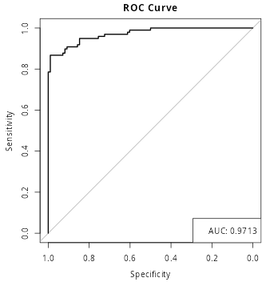

  ```{r, echo=FALSE, message=FALSE,warning=FALSE}
data1 <- read.csv('data/creditcard_original.csv')
# data1 <- read.csv('data/creditcard.csv')
```
# Analyse détaillée du jeu de données
### Dimensions du jeu de données, valeurs manquantes et attributs constants
- **Dimensions** : Le jeu de données contient 284 807 lignes et 31 colonnes, ce qui indique une taille importante de l'échantillon.
- **Valeurs manquantes** : Aucune valeur manquante n'a été détectée, ce qui signifie que l'ensemble des données est complet et qu'il n'y a pas besoin d'opérations de nettoyage concernant les valeurs manquantes.
- **Attributs constants** : Il n'y a pas d'attributs constants, ce qui est un bon signe car des attributs constants n'apporteraient aucune valeur analytique au modèle prédictif.

```{r, echo=FALSE, message=FALSE,warning=FALSE}
# Display the table using knitr::kable() and center it
library(knitr)
library(kableExtra)

# render the summary table
temp<- data1 
# Table logic
renderDT({
  number_of_columns <- ncol(temp)

  number_of_rows <- nrow(temp)

  y <- do.call(rbind, lapply(names(temp), FUN=function(x) {
                               mean <- ifelse(is.numeric(temp[[x]]),
                                              round(mean(temp[[x]], na.rm = TRUE),
                                                    digits = 2),
                                              NA)
                               median <- ifelse(is.numeric(temp[[x]]),
                                                round(stats::median(temp[[x]],
                                                                    na.rm = TRUE),
                                                      digits = 2),
                                                NA)
                               sd <- ifelse(is.numeric(temp[[x]]),
                                            round(stats::sd(temp[[x]],
                                                            na.rm = TRUE),
                                                  digits = 2),
                                            NA)
                               variance <- ifelse(is.numeric(temp[[x]]),
                                                  round(stats::var(temp[[x]],
                                                                   na.rm = TRUE),
                                                        digits = 2),
                                                  NA)
                               max <- ifelse(is.numeric(temp[[x]]), max(temp[[x]],
                                                                        na.rm = TRUE),
                                             NA)
                               min <- ifelse(is.numeric(temp[[x]]), min(temp[[x]],
                                                                        na.rm = TRUE),
                                             NA)
                               IQR <- ifelse(is.numeric(temp[[x]]), IQR(temp[[x]],
                                                                        na.rm =TRUE),
                                             NA)
                               levels <- length(unique(temp[[x]]))
                               c(Column=x,
                                 Class=class(temp[[x]]),
                                 Missing = sum(is.na(temp[[x]])),
                                 Min = min,
                                 Median = median,
                                 Max = max,
                                 Mean = mean,
                                 SD = sd,
                                 Variance = variance,
                                 Unique_Values = as.integer(levels))

}))
  x= list(Rows = number_of_rows, Columns = number_of_columns, Types = y)
  DT::datatable(x$Types,
                class = 'cell-border stripe',
                selection=list(mode="multiple", target="row"),
                rownames=FALSE,
                options = list(scrollX = TRUE, autoWidth = FALSE)
  )
})
```

#### Proportion des individus qui ont churné
Le graphique en camembert indique une proportion très déséquilibrée entre les classes de churn :
- **Non-Churn** : Environ 99.8 % des individus.
- **Churn** : Environ 0.2 % des individus.

Cela montre un problème de déséquilibre de classe, qui est fréquent dans les jeux de données de churn ou de détection de fraude. Cela signifie que les techniques d'échantillonnage (comme le sur-échantillonnage des individus qui ont churné ou le sous-échantillonnage des individus qui n'ont pas churné) pourraient être nécessaires pour améliorer les performances des modèles de machine learning.

```{r, echo=FALSE, message=FALSE,warning=FALSE}
# Load ggplot2
library(ggplot2)

# Create the plot with text labels
ggplot(data1, aes(x = Class)) +
  geom_bar(aes(y = ..count..), fill = "skyblue") +
  geom_text(stat = "count", aes(label = ..count..), 
            vjust = -0.5, size = 5) +  # Adjust vjust for label position
labs(title = "Frequency of Classes", x = "Class", y = "Frequency") +
theme_minimal()
```

####  Variables catégorielles
Aucune variable catégorielle n'a été trouvée dans le jeu de données.
Toutes les variables sont de type numérique.

#### Variables numériques
Nous avons considérés les 3 variables les **plus** corrélées avec Class,
et afficher leurs histogrammes correspondants.

```{r, echo=FALSE, message=FALSE,warning=FALSE}
library(dplyr)
library(tidyr)                  # For pivot_longer
library(ggplot2)
library(DT)
# Calculate correlations between numerical variables and the class
importance <- data1 %>%
  mutate(Class = as.numeric(as.factor(Class))) %>%
  summarise(across(starts_with("V"), ~ abs(cor(.x, Class)))) %>%
  pivot_longer(cols = everything(), names_to = "Variable", values_to = "Correlation") %>%
  arrange(desc(Correlation))

# Display the correlation data using DT
renderDataTable(
                importance,
                options = list(
                               pageLength = 15,  # Show 5 rows per page
                               autoWidth = TRUE  # Automatically adjust column widths
                               ),
                rownames = FALSE  # Do not show row numbers
)
```


```{r, echo=FALSE, message=FALSE,warning=FALSE}
top_variables <- importance %>%
  top_n(3, Correlation) %>%
  pull(Variable)

top_variables
# Reshape data for ggplot
df_long <- data1 %>%
  select(all_of(top_variables), Class) %>%
  pivot_longer(cols = all_of(top_variables), names_to = "Variable", values_to = "Value")

# Create histograms for top correlated variables colored by class
# Filter out non-positive values
ggplot(df_long, aes(x = Value, fill = as.factor(Class))) +
  geom_histogram(
                 alpha = 0.5, 
                 drop=T) +
                facet_wrap(~ Variable) +
                labs(title = "Histograms of Top 3 Correlated Variables by Class",
                     x = "Value",
                     y = "Count",
                     fill = "Class") +
                scale_y_log10() +  # Apply logarithmic scale to the y-axis
                theme_minimal()

```


```{r, echo=FALSE, message=FALSE,warning=FALSE}

top_variables <- importance %>%
  slice_min(order_by = Correlation, n = 3) %>%
  pull(Variable)

top_variables
# Reshape data for ggplot
df_long <- data1 %>%
  select(all_of(top_variables), Class) %>%
  pivot_longer(cols = all_of(top_variables), names_to = "Variable", values_to = "Value")

# Create histograms for top correlated variables colored by class
# Filter out non-positive values
ggplot(df_long, aes(x = Value, fill = as.factor(Class))) +
  geom_histogram(
                 alpha = 0.5, 
                 drop=T) +
                facet_wrap(~ Variable) +
                labs(title = "Histograms of Least 3 Correlated Variables by Class",
                     x = "Value",
                     y = "Count",
                     fill = "Class") +
                scale_y_log10() +  # Apply logarithmic scale to the y-axis
                theme_minimal()

```

##### Analyse des variables numériques (histogrammes)
L'analyse des distributions pour chaque variable numérique a révélé plusieurs points intéressants :

- Certaines variables, comme **V12**, **V14**, et **V17**, n'affichent pas de distinction claire entre les distributions pour les deux groupes. Contrairement aux variables **V22**, **V23**, et **V25** qui montrent des différences significatives dans leurs distributions entre les individus qui ont churné et ceux qui ne l'ont pas fait.

Ces observations suggèrent que certaines variables ont un pouvoir discriminant important pour séparer les individus churn et non-churn, et elles devront être priorisées lors de l'analyse.

## Matrice de corrélation des attributs
```{r, echo=FALSE, message=FALSE,warning=FALSE}

# Select only numeric variables from the dataset
numeric_vars <- data1 %>% select_if(is.numeric)

# Ensure there are at least two numeric columns to compute correlation
# Calculate the correlation matrix
correlation_matrix <- cor(numeric_vars, use = "complete.obs")


# Melt the correlation matrix into long format for ggplot
corr_melted <- reshape2::melt(correlation_matrix)

# Create the correlation matrix heatmap
corr_plot <- ggplot(corr_melted, aes(Var1, Var2, fill = value)) +
  geom_tile(color = "white") +
  scale_fill_gradient2(low = "red", high = "blue", mid = "white",
                       midpoint = 0, limit = c(-1, 1), space = "Lab",
                       name = "Correlation") +
                #theme_minimal() +
                theme(axis.text.x = element_text(angle = 45, vjust = 1, 
                                                 size = 12, hjust = 1),
                      axis.text.y = element_text(size = 12)) +
                coord_fixed() +
                ggtitle("Correlation Matrix") +
                theme(plot.title = element_text(face = "bold", color = "#2E8B57", size = 14, hjust = 0.5))
              corr_plot
```

Le graphique montre la matrice de corrélation basée sur l'ensemble de données original, où une classe est majoritaire. Cela peut entraîner des corrélations biaisées, dominées par cette classe.

Pour corriger cela, nous allons équilibrer les données en prélevant un nombre égal d'exemples dans chaque classe.

```{r, echo=FALSE, message=FALSE,warning=FALSE}
# Split data into two groups based on class labels
minority_class <- data1 %>% filter(Class == 1)
majority_class <- data1 %>% filter(Class == 0)

# Determine the size of the minority class
minority_class_size <- nrow(minority_class)
majority_class_size <- nrow(majority_class)

# Subsample the majority class to match the size of the minority class
majority_class_sample <- majority_class %>% sample_n(minority_class_size)

# Combine the minority class and the subsampled majority class
balanced_data <- bind_rows(minority_class, majority_class_sample)

# Now proceed with correlation matrix analysis using only numeric columns
numeric_vars <- balanced_data %>% select_if(is.numeric)

# Calculate the correlation matrix
correlation_matrix <- cor(numeric_vars, use = "complete.obs")

# Melt the correlation matrix for ggplot
corr_melted <- melt(correlation_matrix)

# Create the correlation matrix heatmap
corr_plot <- ggplot(corr_melted, aes(Var1, Var2, fill = value)) +
  geom_tile(color = "white") +
  scale_fill_gradient2(low = "red", high = "blue", mid = "white",
                       midpoint = 0, limit = c(-1, 1), space = "Lab",
                       name = "Correlation") +
                theme(axis.text.x = element_text(angle = 45, vjust = 1, 
                                                 size = 12, hjust = 1),
                      axis.text.y = element_text(size = 12)) +
                coord_fixed() +
                ggtitle("Correlation Matrix (Balanced Data)") +
                theme(plot.title = element_text(face = "bold", color = "#2E8B57", size = 14, hjust = 0.5))

# Display the plot
corr_plot
```

L'examen de la matrice de corrélation a révélé les points suivants :

- Les variables telles que **V10**, **V12**, **V14**, et **V17** montrent des corrélations modérées à fortes avec la variable `Class` (churn). Cela signifie que ces variables pourraient être des indicateurs importants du comportement de churn.
- Plusieurs autres variables montrent également des corrélations, mais en raison de la taille importante du jeu de données et des corrélations entre les variables elles-mêmes, nous allons nous concentrer uniquement sur les variables les plus pertinentes. Cela permet de réduire la complexité du modèle tout en évitant les problèmes de multicolinéarité.
## B- Conclusions globales
- **Attributs influents** : Les variables comme **V10**, **V12**, **V14**, et **V17** semblent jouer un rôle significatif dans la prédiction du churn. Elles méritent une attention particulière lors de la construction d'un modèle prédictif.
- **Déséquilibre de classe** : Le jeu de données est fortement déséquilibré, avec une majorité écrasante d'individus qui n'ont pas churné. Cet aspect devra être traité pour éviter que les modèles de machine learning ne soient biaisés en faveur de la classe majoritaire.
- **Stratégies d'amélioration** : Des techniques telles que l'ingénierie des caractéristiques, la sélection des variables, et la gestion du déséquilibre de classe seront cruciales pour obtenir des performances optimales dans les prédictions de churn.

Ces conclusions fournissent une base solide pour construire un modèle prédictif en utilisant les variables identifiées et pour appliquer des stratégies spécifiques au déséquilibre de classe.

# Prediction de Churn

### Métriques

En considérant uniquement les 4 variables les plus importantes soient: **V10**, **V12**, **V14**, et **V17**. Voici les résultats obtenus

```{r, echo=FALSE, message=FALSE,warning=FALSE}
library(knitr)
library(kableExtra)

# Create the data frame for performance metrics
data <- data.frame(
                   `Data Approach` = c(rep("Data Brute", 4),
                                       rep("Undersampling", 4),
                                       rep("Oversampling", 4)),
                   Model = c("DT", "LG", "SVM", "SVM_RBF", "DT", "LG",
                             "SVM", "SVM_RBF", "DT", "LG", "SVM", "SVM_RBF"),
                   `AUC Default` = c(0.74, 0.946, 0.95, 0.80, 0.8855, 0.96,
                                     0.96, 0.96, 0.89, 0.91, 0.91, 0.97),
                   `AUC Grid Search` = c(0.79, 0.955, 0.96, 0.84, 0.886, 0.95,
                                         0.96, 0.97, 0.89, 0.91, 0.92, 0.98)
)

# Create the table using kable and kableExtra
# Create the table using kable and kableExtra
kable(data,
      caption = "Prediction Results: Performance Metrics for Different Data Balancing Techniques",
      booktabs = TRUE) %>%
  kable_styling(full_width = TRUE,
                position = "center",
                font_size = 14) %>% # Set full width and increase font size
  row_spec(0, bold = TRUE,
           color = "white",
           background = "#4CAF50") %>% # Header row styling
  column_spec(1, 
              bold = TRUE) %>% # Bold the first column (Data Approach)
  collapse_rows(columns = 1,
                valign = "middle") %>% # Merge rows for Data Approach column
  kable_styling(bootstrap_options = c("striped", "hover", "condensed", "responsive"))
```

- Les courbes ROC suivantes comparent les performances du modèle 
  SVM RBF avec les paramètres par défaut et ceux obtenus par recherche par grille (grid search).
<div style="display: flex; justify-content: space-between;">

<div style="flex: 1; text-align: center;">
  
  
  <p><strong>Default Parameters</strong></p>
  
</div>
<div style="flex: 1; text-align: center;">
  
  
  <p><strong>Grid Search</strong></p>
  
</div>

</div>

### Observations

- Il semble que le modèle **SVM RBF** offre les meilleures performances avec 
  des valeurs élevées de **ROC** dans les trois approches de données.
- Cependant, il est important de noter que les données sont fortement déséquilibrées,
  ce qui pourrait biaiser les performances du modèle.
- Les résultats montrent que l'**oversampling** et l'**undersampling** 
  améliorent considérablement les performances des modèles, 
  avec des scores plus élevés en **ROC Grid** comparé à l'approche brute.
