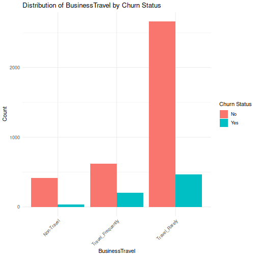
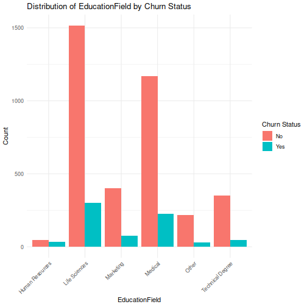
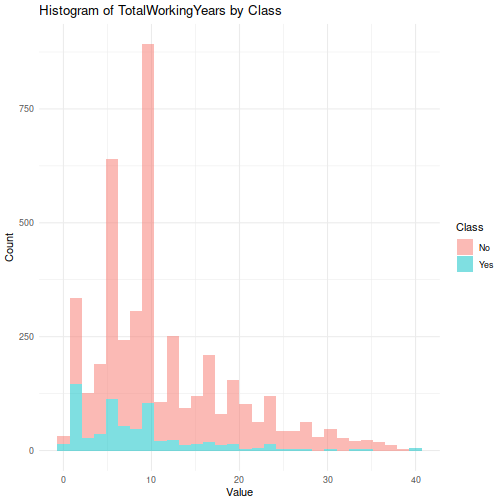

# Analyse exploratoire des donn´ees
## Data Summary

Below is a table showing the number of missing values and the number of unique values for each column in Data 1.
- size: `

```
## 41188 21
```

<!--html_preserve--><div class="datatables html-widget html-widget-output shiny-report-size html-fill-item-overflow-hidden html-fill-item" id="out7b3be2aa5584c11d" style="width:100%;height:auto;"></div><!--/html_preserve-->
## Class Distribution

This section presents a bar plot showing the count of rows in the data frame `df` for each class (0 and 1).


### relation catagorical variable/churn 
- most of the features are catagorical except:
  - age
  - duration 
  - euribor3m
  - pdays 
  - cons.price.idx
  - cons.conf.idx
  - nr.employed
  - campaign
We will convert all the others to categorical

- finding the most important catgeorical varialbes:
<!--html_preserve--><div class="datatables html-widget html-widget-output shiny-report-size html-fill-item-overflow-hidden html-fill-item" id="outb0668aca65c60b26" style="width:100%;height:auto;"></div><!--/html_preserve-->

#### Plotting the top 3 

#### Plotting the top 3 rates 


### relation numerical variable/churn 
- this are the correlations between each numerical variable and the class
<!--html_preserve--><div class="datatables html-widget html-widget-output shiny-report-size html-fill-item-overflow-hidden html-fill-item" id="out8ed05c2edb2c4175" style="width:100%;height:auto;"></div><!--/html_preserve-->
#### plotting the biggest 3 count
#### plotting the least 3 

#### Correlation matrix

## Conclusion:
- blah blah blah
# Prediction de churn
- we are just going to use v2, v4, v8 and v11 since the dataset is very large
