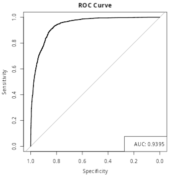
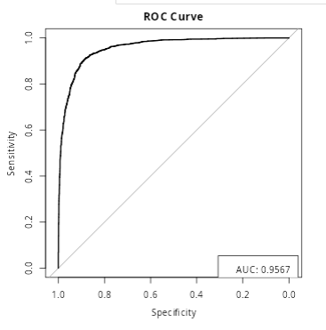

```{r, echo=FALSE}
data2 <- read.csv('data/bank-additional-full.csv',
                  na.strings = c("", "NA", "?","unknown",'999'))
```

# Analyse détaillée du nouveau jeu de données

#### Dimensions du jeu de données, valeurs manquantes et attributs constants
- **Dimensions** : Le jeu de données contient 41 188 lignes et 21 colonnes.
- **Valeurs manquantes** : Certaines colonnes contiennent des valeurs manquantes :
  - `job` : 330 valeurs manquantes
  - `marital` : 80 valeurs manquantes
  - `education` : 1 731 valeurs manquantes
  - `default` : 8 597 valeurs manquantes
  - `housing` et `loan` : 990 valeurs manquantes chacune

  Ces valeurs manquantes doivent être traitées avant de construire un modèle prédictif, car elles pourraient introduire du biais ou réduire la précision du modèle.
- **Attributs constants** : Aucun attribut constant n'a été identifié, ce qui signifie qu'aucune variable n'est triviale et toutes peuvent potentiellement apporter des informations.

```{r, echo=FALSE}
# Display the table using knitr::kable() and center it
library(knitr)
library(kableExtra)

 # render the summary table
 renderDT({
  temp<- data2 
  number_of_columns <- ncol(temp)

  number_of_rows <- nrow(temp)

  y <- do.call(rbind, lapply(names(temp), FUN=function(x) {
    mean <- ifelse(is.numeric(temp[[x]]), round(mean(temp[[x]], na.rm = TRUE), digits = 2), NA)
    median <- ifelse(is.numeric(temp[[x]]), round(stats::median(temp[[x]], na.rm = TRUE), digits = 2), NA)
    sd <- ifelse(is.numeric(temp[[x]]), round(stats::sd(temp[[x]], na.rm = TRUE), digits = 2), NA)
    variance <- ifelse(is.numeric(temp[[x]]), round(stats::var(temp[[x]], na.rm = TRUE), digits = 2), NA)
    max <- ifelse(is.numeric(temp[[x]]), max(temp[[x]], na.rm = TRUE), NA)
    min <- ifelse(is.numeric(temp[[x]]), min(temp[[x]], na.rm = TRUE), NA)
    IQR <- ifelse(is.numeric(temp[[x]]), IQR(temp[[x]], na.rm =TRUE), NA)
    levels <- length(unique(temp[[x]]))
    c(Column=x,
      Class=class(temp[[x]]),
      Missing = sum(is.na(temp[[x]])),
      Unique_Values = as.integer(levels))

  }))
      x= list(Rows = number_of_rows, Columns = number_of_columns, Types = y)
      DT::datatable(x$Types,
                class = 'cell-border stripe',
                selection=list(mode="multiple", target="row"),
                rownames=FALSE,
                options = list(scrollX = TRUE, autoWidth = FALSE)
                )
    }
  )
```

#### Proportion des individus ayant répondu "yes" ou "no"
Le graphique en bars indique une proportion déséquilibrée entre les réponses :
- **No** : La majorité des individus, environ 88.7 %, ont répondu "no".
- **Yes** : Environ 11.3 % des individus ont répondu "yes".

Ce déséquilibre de classe suggère qu'il faudra peut-être utiliser des techniques pour gérer les données déséquilibrées, comme le sur-échantillonnage de la classe minoritaire ou le sous-échantillonnage de la classe majoritaire, afin d'améliorer les performances des modèles de prédiction.


```{r, echo=FALSE, message=FALSE}
# Load ggplot2
library(ggplot2)

# Create the plot with text labels
ggplot(data2, aes(x = y)) +
  geom_bar(aes(y = ..count..), fill = "skyblue") +
  geom_text(stat = "count", aes(label = ..count..), 
            vjust = -0.5, size = 5) +  # Adjust vjust for label position
  labs(title = "Frequency of Classes", x = "Class", y = "Frequency") +
  theme_minimal()
```

###  Analyse des variables catégorielles
**La plupart des caractéristiques sont catégorielles, à l'exception des suivantes :**

- `age`
- `duration`
- `euribor3m`
- `pdays`
- `cons.price.idx`
- `cons.conf.idx`
- `nr.employed`
- `campaign`

```{r, echo=FALSE, message=FALSE}
# Define the numeric columns that should remain numeric
numeric_columns <- c("age", "duration", "euribor3m", "pdays", 
                     "cons.price.idx", "cons.conf.idx", "nr.employed", "campaign")

# Convert all other columns to factors (categorical)
data2 <- data2 %>%
  mutate(across(.cols = -all_of(numeric_columns), ~ as.factor(.)))
```

- Pour évaluer l'importance des variables catégorielles,
  nous utiliserons le test du Chi-Carré.
  Plus la p-value est faible, plus la corrélation est élevée.
```{r,echo=FALSE,message=FALSE,warning=FALSE}
# Set the minimum count threshold for each level
min_count_threshold <-5 

# Function to check if a variable has enough observations per level
has_enough_levels <- function(variable, threshold) {
  tbl <- table(variable)
  return(all(tbl >= threshold))  # Check if all counts meet the threshold
}

# Get the names of categorical variables with enough counts
valid_variables <- data2 %>%
  select(-all_of(c(numeric_columns,'y'))) %>%
  summarise(across(everything(), 
                   ~ has_enough_levels(.x, min_count_threshold))) %>%
  pivot_longer(cols = everything(), names_to = "Variable", values_to = "Has_Enough_Levels") %>%
  filter(Has_Enough_Levels) %>%
  pull(Variable)

# Perform Chi-Square test for each valid categorical variable
importanceCat <- data2 %>%
  select(all_of(valid_variables)) %>%  # Select only valid variables
  summarise(across(everything(), 
    ~ chisq.test(table(.x, data2$y))$p.value)) %>%  # Replace 'y' with your binary target
  pivot_longer(cols = everything(), 
    names_to = "Variable", values_to = "P_Value") %>%
  arrange(P_Value)  # Sort by p-value

# Render the DataTable
renderDataTable(
  importanceCat,
  options = list(
    pageLength = 15,  # Show 15 rows per page
    autoWidth = TRUE  # Automatically adjust column widths
  ),
  rownames = FALSE  # Do not show row numbers
)
```

#### Valeurs Absolues
```{r, echo=FALSE, message=FALSE}
library(ggplot2)
library(dplyr)
library(tidyr)

# Assuming you've already calculated 'importanceCat' with p-values from Chi-Square tests

# Get the top 3 variables based on their p-values
top3_variables <- importanceCat %>%
  top_n(-3, P_Value) %>%  # Select the top 3 variables with the smallest p-values
  pull(Variable)

# Loop through each of the top 3 variables and create a bar plot
for (var in top3_variables) {
  plot_data <- data2 %>%
    group_by(!!sym(var), y) %>%
    summarise(count = n()) %>%
    ungroup()
  
  # Create a bar plot for the variable
  p <- ggplot(plot_data, aes(x = !!sym(var), y = count, fill = factor(y))) +
    geom_bar(stat = "identity", position = "dodge") +
    labs(title = paste("Distribution of", var, "by Churn Status"),
         x = var,
         y = "Count",
         fill = "Churn Status") +
    theme_minimal() +
    theme(axis.text.x = element_text(angle = 45, hjust = 1))
  
  print(p)  # Ensure each plot is printed during the loop
}
```
#### Taux de Churn vs. Non-Churn
```{r, echo=FALSE, message=FALSE}

library(ggplot2)
library(dplyr)
library(tidyr)

# Assuming you've already calculated 'importanceCat' with p-values from Chi-Square tests

# Get the top 3 variables based on their p-values
top3_variables <- importanceCat %>%
  top_n(-3, P_Value) %>%  # Select the top 3 variables with the smallest p-values
  pull(Variable)

# Loop through each of the top 3 variables and create a churn rate plot
for (var in top3_variables) {
  plot_data <- data2 %>%
    group_by(!!sym(var), y) %>%
    summarise(count = n()) %>%
    group_by(!!sym(var)) %>%
    mutate(churn_rate = count / sum(count)) %>%  # Calculate churn rate
    filter(y == "yes") %>%  # Keep only the churn rate (where y == 1)
    ungroup()
  
  # Create a bar plot showing churn rate
  p <- ggplot(plot_data, aes(x = !!sym(var), y = churn_rate, fill = factor(y))) +
    geom_bar(stat = "identity", position = "dodge", fill = "steelblue") +
    labs(title = paste("Churn Rate by", var),
         x = var,
         y = "Churn Rate",
         fill = "Churn Status") +
    scale_y_continuous(labels = scales::percent_format()) +  # Show y-axis as percentage
    theme_minimal() +
    theme(axis.text.x = element_text(angle = 45, hjust = 1))
  
  print(p)  # Ensure each plot is printed during the loop
}
```

- Les graphiques de répartition montrent que certaines variables catégorielles présentent des différences significatives dans les proportions de "yes" et "no" :
- **emp.var.rate**, **month**, et **poutcome** montrent des écarts clairs entre les proportions de "yes" et "no", ce qui indique qu'elles sont probablement des prédicteurs importants pour déterminer la réponse cible.

### Analyse des variables numériques 
```{r, echo=FALSE, message=FALSE}
library(dplyr)
library(tidyr)                  # For pivot_longer
library(ggplot2)
library(DT)
# Calculate correlations between numerical variables and the class
importance <- data2 %>%
  # Ensure 'y' is numeric (assuming 'y' is a column in data2)
  mutate(y = as.numeric(as.factor(y))) %>%
  # Apply cor() only to numeric columns, calculating correlation with 'y'
  summarise(across(where(is.numeric), ~ abs(cor(.x, y, use = "complete.obs")))) %>%
  # Pivot to long format for better readability and sorting
  pivot_longer(cols = everything(), names_to = "Variable", values_to = "abs_Correlation") %>%
  # Remove the correlation of 'y' with itself
  filter(Variable != "y") %>%
  # Sort the variables by correlation in descending order
  arrange(desc(abs_Correlation))

# Display the correlation data using DT
renderDataTable(
  importance,
  options = list(
    pageLength = 15,  # Show 5 rows per page
    autoWidth = TRUE  # Automatically adjust column widths
  ),
  rownames = FALSE  # Do not show row numbers
)
```
```{r, echo=FALSE, message=FALSE,warning=FALSE}
top_variables <- importance %>%
   slice_min(order_by = abs_Correlation, n = 3) %>%
  pull(Variable)

# Reshape data for ggplot
df_long <- data2 %>%
  select(all_of(top_variables), y) %>%
  pivot_longer(cols = all_of(top_variables), names_to = "Variable", values_to = "Value")

top_variables <- importance %>%
   slice_min(order_by = abs_Correlation, n = 3) %>%
  pull(Variable)

# Create separate plots for each variable
for (variable in top_variables) {
  plot<-ggplot(df_long %>% filter(Variable == variable), aes(x = Value, fill = as.factor(y))) +
    geom_histogram(alpha = 0.5, drop = TRUE) +
    labs(title = paste("Histogram of", variable, "by Class"),
         x = "Value",
         y = "Count",
         fill = "Class") +
    #scale_y_log10() +  # Apply logarithmic scale to the y-axis
    theme_minimal() 

    print(plot)
    }

```

## 5. Matrice de corrélation des attributs
L'analyse de la matrice de corrélation met en évidence les points suivants :
- Les variables telles que **euribor3m**, **nr.employed**, et **emp.var.rate** présentent des corrélations significatives entre elles ainsi qu'avec la variable cible, ce qui peut indiquer qu'elles sont étroitement liées au comportement observé dans les données.
- Les faibles corrélations directes pour certaines autres variables suggèrent qu'elles ont moins d'impact isolé sur la variable cible ou qu'elles pourraient interagir de manière plus complexe avec d'autres variables.

```{r, echo=FALSE, message=FALSE}

    # Select only numeric variables from the dataset
    numeric_vars <- data2 %>% select_if(is.numeric)

    # Ensure there are at least two numeric columns to compute correlation
        # Calculate the correlation matrix
        correlation_matrix <- cor(numeric_vars, use = "complete.obs")

        # Melt the correlation matrix into long format for ggplot
        corr_melted <- reshape2::melt(correlation_matrix)

        # Create the correlation matrix heatmap
        corr_plot <- ggplot(corr_melted, aes(Var1, Var2, fill = value)) +
            geom_tile(color = "white") +
            scale_fill_gradient2(low = "red", high = "blue", mid = "white",
                                 midpoint = 0, limit = c(-1, 1), space = "Lab",
                                 name = "Correlation") +
            #theme_minimal() +
            theme(axis.text.x = element_text(angle = 45, vjust = 1, 
                                             size = 12, hjust = 1),
                  axis.text.y = element_text(size = 12)) +
            coord_fixed() +
            ggtitle("Correlation Matrix") +
            theme(plot.title = element_text(face = "bold", color = "#2E8B57", size = 14, hjust = 0.5))
    corr_plot
```

## B- Conclusions globales
- **Variables influentes** : Les variables comme **duration**, **euribor3m**, **nr.employed**, et certaines variables catégorielles comme **emp.var.rates**, **month**, et **poutcome** semblent jouer un rôle clé dans la prédiction de la réponse cible "yes". Elles devraient être prioritaires dans l'élaboration d'un modèle de prédiction.
- **Déséquilibre de classe** : Le déséquilibre de la classe cible (majorité de "no") devra être traité avec des techniques adaptées pour améliorer les performances du modèle.
- **Stratégies d'amélioration** : Des techniques d'ingénierie des caractéristiques, de sélection des variables et de gestion des valeurs manquantes seront essentielles pour obtenir des résultats optimaux lors de la construction du modèle prédictif.

Ces conclusions fournissent une base solide pour aborder la modélisation prédictive de ce jeu de données en utilisant les variables et stratégies identifiées.


# Prediction de Churn

### Métriques

```{r, echo=FALSE, message=FALSE}
library(knitr)
library(kableExtra)

# Create the data frame for the new performance metrics
new_data <- data.frame(
  `Data Approach` = c(rep("No Balancing", 4), rep("Undersampling", 4), rep("Oversampling", 4)),
  Model = c("DT", "LG", "SVM", "SVM_RBF", "DT", "LG", "SVM", "SVM_RBF", "DT", "LG", "SVM", "SVM_RBF"),
  `ROC Default` = c(0.72, 0.91, 0.93, 0.89, 0.72, 0.91, 0.93, 0.89, 0.80, 0.88, 0.91, 0.94),
  `ROC Grid` = c(0.84, 0.91, 0.92, 0.91, 0.84, 0.92, 0.93, 0.91, 0.87, 0.89, 0.92, 0.96)
)

# Create the table using kable and kableExtra
kable(new_data, caption = "Prediction Results: Performance Metrics for Different Data Balancing Techniques", booktabs = TRUE) %>%
  kable_styling(full_width = TRUE, position = "center", font_size = 14) %>% # Set full width and increase font size
  row_spec(0, bold = TRUE, color = "white", background = "#4CAF50") %>% # Header row styling
  column_spec(1, bold = TRUE) %>% # Bold the first column (Data Approach)
  collapse_rows(columns = 1, valign = "middle") %>% # Merge rows for Data Approach column
  kable_styling(bootstrap_options = c("striped", "hover", "condensed", "responsive"))
```
### Observations
Pas d'équilibrage :

- Le modèle SVM montre la meilleure performance avec ROC Default à 0,93, bien que son ROC Grid diminue légèrement à 0,92.
- Les modèles LG et SVM_RBF ont des performances relativement similaires, mais SVM_RBF montre des résultats légèrement meilleurs dans le ROC Grid.
Sous-échantillonnage :

- Le modèle SVM maintient sa forte performance avec ROC Default et ROC Grid à 0,93, indiquant sa stabilité avec des données sous-échantillonnées.
-  LG montre une légère amélioration dans le ROC Grid par rapport au modèle par défaut, suggérant que l'ajustement de la grille améliore ses capacités prédictives.
Sur-échantillonnage :

- Le modèle SVM_RBF se distingue avec la meilleure performance, atteignant un ROC Default de 0,94 et un ROC Grid de 0,96, ce qui en fait le modèle le plus adapté dans des conditions de sur-échantillonnage.
- L'arbre de décision (DT) montre une amélioration significative dans le ROC Grid avec le sur-échantillonnage par rapport à l'absence d'équilibrage, indiquant qu'il bénéficie de l'augmentation de la taille de l'ensemble de données.

<div style="display: flex; justify-content: space-between;">

<div style="flex: 1; text-align: center;">
  
  
  <p><strong>Oversampling with Default Paramters</strong></p>
  
</div>
<div style="flex: 1; text-align: center;">
  
  
  <p><strong>Oversampling with Grid Search</strong></p>
  
</div>

</div>

### Observations Générales
- Performance des Modèles SVM : Les modèles SVM et SVM_RBF surpassent systématiquement les autres modèles à travers toutes les techniques d'équilibrage des données, SVM_RBF montrant des résultats particulièrement solides en sur-échantillonnage.
- Impact de l'Équilibrage des Données : Les techniques de sous-échantillonnage et de sur-échantillonnage améliorent généralement la performance des modèles, le sur-échantillonnage montrant l'augmentation la plus cohérente des valeurs ROC Grid.
- Stabilité du Modèle : Les modèles d'arbre de décision ont des scores ROC inférieurs par rapport aux modèles SVM, mais montrent une amélioration significative lorsqu'un réglage est appliqué et lorsque l'équilibrage des données est utilisé.
- Ces résultats suggèrent que les modèles SVM (en particulier SVM_RBF) offrent la meilleure performance prédictive, notamment lorsque les données sont équilibrées par sur-échantillonnage. Les techniques d'équilibrage sont cruciales pour améliorer la précision du modèle, en particulier dans des scénarios avec des ensembles de données déséquilibrés.
