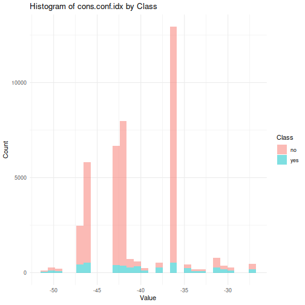
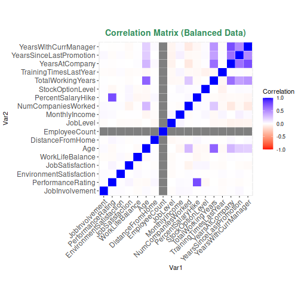

# Analyse exploratoire des donn´ees
## Data Summary

Below is a table showing the number of missing values and the number of unique values for each column in Data 1.
- size: `

```
## 4410 29
```

<!--html_preserve--><div class="datatables html-widget html-widget-output shiny-report-size html-fill-item-overflow-hidden html-fill-item" id="outdaaddb03a5567b3b" style="width:100%;height:auto;"></div><!--/html_preserve-->
- initial notes:
  - 3 constant columns (Over18, employeeCount, StandardHours)
  - 1 ID class (EmployeeID)
  - 1 Categorical variable (Education)
  - The rest are numeric variables


## Class Distribution

This section presents a bar plot showing the count of rows in the data frame `df` for each class (0 and 1).

### relation catagorical variable/churn 

- finding the most important catgeorical varialbes:
<!--html_preserve--><div class="datatables html-widget html-widget-output shiny-report-size html-fill-item-overflow-hidden html-fill-item" id="out851ce22aed22e1f6" style="width:100%;height:auto;"></div><!--/html_preserve-->

#### Plotting the top 3 

#### Plotting the top 3 rates 


### relation numerical variable/churn 
- this are the correlations between each numerical variable and the class
<!--html_preserve--><div class="datatables html-widget html-widget-output shiny-report-size html-fill-item-overflow-hidden html-fill-item" id="out98e2217cde112107" style="width:100%;height:auto;"></div><!--/html_preserve-->
#### plotting the biggest 3 count

#### Correlation matrix

## Conclusion:
- blah blah blah
# Prediction de churn
- we are just going to use v2, v4, v8 and v11 since the dataset is very large
