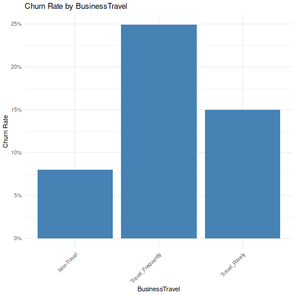
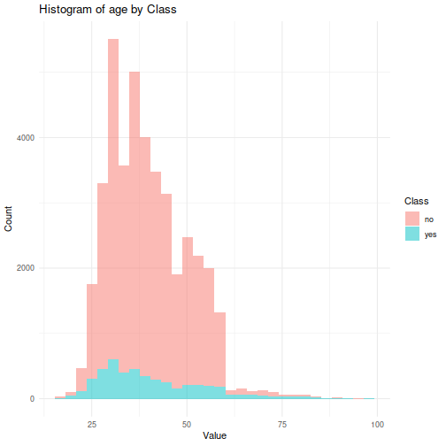
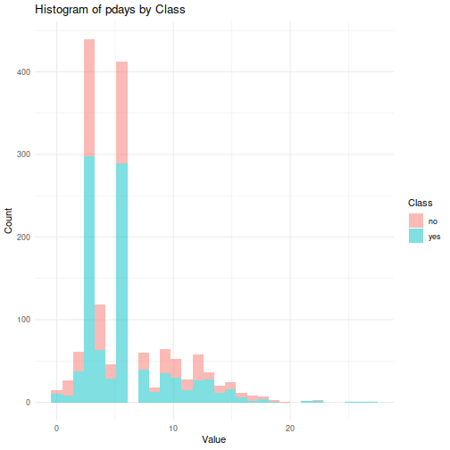

# Analyse détaillée du jeu de données "whole data"

#### 1. Dimensions du jeu de données, valeurs manquantes et attributs constants
- **Dimensions** : Le jeu de données contient 4 410 lignes et 29 colonnes.
- **Valeurs manquantes** : Certaines colonnes contiennent des valeurs manquantes :
  - `EnvironmentSatisfaction` : 25 valeurs manquantes
  - `JobSatisfaction` : 20 valeurs manquantes
  - `WorkLifeBalance` : 38 valeurs manquantes
  - `NumCompaniesWorked` : 19 valeurs manquantes
  - `TotalWorkingYears` : 9 valeurs manquantes

  Ces valeurs manquantes devront être traitées pour éviter des problèmes dans les analyses ou les modèles prédictifs.
  
- **Attributs constants** : Les colonnes `EmployeeCount`, `Over18`, et `StandardHours` sont constantes, ce qui signifie qu'elles n'apportent aucune information utile et peuvent être exclues des analyses.

- 1 colonne identifiant (`EmployeeID`)
- 1 variable catégorielle (`Education`)
- Les autres colonnes sont des variables numériques


```
## 4410 29
```

<!--html_preserve--><div class="datatables html-widget html-widget-output shiny-report-size html-fill-item-overflow-hidden html-fill-item" id="out8d5b4e55c9ba0631" style="width:100%;height:auto;"></div><!--/html_preserve-->


#### 2. Proportion des individus ayant quitté l'entreprise (Attrition)
Le graphique en bars indique une proportion déséquilibrée entre les réponses :
- **No** : La majorité des individus, environ 84.4 %, sont restés dans l'entreprise.
- **Yes** : Environ 15.6 % des individus ont quitté l'entreprise.

Ce déséquilibre de classe suggère qu'il faudra peut-être utiliser des techniques pour gérer les données déséquilibrées, telles que le sur-échantillonnage des cas d'attrition ou le sous-échantillonnage des cas de non-attrition, pour améliorer la performance des modèles prédictifs.


## 3. Analyse des variables catégorielles


- Considérons uniquement les variables les **plus importantes**: 

<!--html_preserve--><div class="datatables html-widget html-widget-output shiny-report-size html-fill-item-overflow-hidden html-fill-item" id="outeec31cd91127d9a4" style="width:100%;height:auto;"></div><!--/html_preserve-->
#### Top 3 

#### Top 3 rates 


#### 4. Analyse des variables numériques
- this are the correlations between each numerical variable and the class
<!--html_preserve--><div class="datatables html-widget html-widget-output shiny-report-size html-fill-item-overflow-hidden html-fill-item" id="outc86edc808b6fa7aa" style="width:100%;height:auto;"></div><!--/html_preserve-->
#### Top 3 count


#### 5. Matrice de corrélation des attributs
L'analyse de la matrice de corrélation met en évidence les points suivants :
- **Corrélations importantes** : Certaines variables montrent des corrélations significatives entre elles, comme **TotalWorkingYears**, **YearsAtCompany**, et **MonthlyIncome**, qui pourraient jouer un rôle clé dans l'attrition.
- **Relations complexes** : D'autres variables montrent des corrélations modérées ou faibles, suggérant que leur impact pourrait être plus complexe et dépendre d'interactions avec d'autres variables.

Ces relations doivent être considérées lors de la construction de modèles pour garantir que toutes les interactions pertinentes soient prises en compte.


#### B- Conclusions globales
- **Variables influentes** : Les variables comme **Age**, **MonthlyIncome**, **YearsAtCompany**, et certaines variables catégorielles comme **BusinessTravel**, **JobRole**, et **MaritalStatus** semblent jouer un rôle clé dans la prédiction de l'attrition. Elles devraient être priorisées dans l'élaboration d'un modèle de prédiction.
- **Déséquilibre de classe** : Le déséquilibre de la classe cible (majorité de non-attrition) devra être traité avec des techniques adaptées pour éviter les biais dans le modèle prédictif.
- **Stratégies d'amélioration** : Il sera essentiel d'appliquer des techniques d'ingénierie des caractéristiques, de sélection des variables, et de gestion des valeurs manquantes pour obtenir des résultats optimaux lors de la construction du modèle.

Ces conclusions fournissent une base solide pour aborder la modélisation prédictive de ce jeu de données en utilisant les variables et stratégies identifiées.


# Prediction de Churn

### Métriques
<table class="table table table-striped table-hover table-condensed table-responsive" style="font-size: 14px; margin-left: auto; margin-right: auto; margin-left: auto; margin-right: auto;">
<caption style="font-size: initial !important;">Prediction Results: Performance Metrics for Different Data Balancing Techniques</caption>
 <thead>
  <tr>
   <th style="text-align:left;font-weight: bold;color: white !important;background-color: rgba(76, 175, 80, 255) !important;"> Data.Approach </th>
   <th style="text-align:left;font-weight: bold;color: white !important;background-color: rgba(76, 175, 80, 255) !important;"> Model </th>
   <th style="text-align:right;font-weight: bold;color: white !important;background-color: rgba(76, 175, 80, 255) !important;"> ROC.Default </th>
   <th style="text-align:right;font-weight: bold;color: white !important;background-color: rgba(76, 175, 80, 255) !important;"> ROC.Grid </th>
  </tr>
 </thead>
<tbody>
  <tr>
   <td style="text-align:left;font-weight: bold;vertical-align: middle !important;" rowspan="4"> No Balancing </td>
   <td style="text-align:left;"> DT </td>
   <td style="text-align:right;"> 0.60 </td>
   <td style="text-align:right;"> 0.66 </td>
  </tr>
  <tr>
   
   <td style="text-align:left;"> LG </td>
   <td style="text-align:right;"> 0.74 </td>
   <td style="text-align:right;"> 0.74 </td>
  </tr>
  <tr>
   
   <td style="text-align:left;"> SVM </td>
   <td style="text-align:right;"> 0.57 </td>
   <td style="text-align:right;"> 0.61 </td>
  </tr>
  <tr>
   
   <td style="text-align:left;"> SVM_RBF </td>
   <td style="text-align:right;"> 0.95 </td>
   <td style="text-align:right;"> 0.99 </td>
  </tr>
  <tr>
   <td style="text-align:left;font-weight: bold;vertical-align: middle !important;" rowspan="4"> Undersampling </td>
   <td style="text-align:left;"> DT </td>
   <td style="text-align:right;"> 0.63 </td>
   <td style="text-align:right;"> 0.75 </td>
  </tr>
  <tr>
   
   <td style="text-align:left;"> LG </td>
   <td style="text-align:right;"> 0.74 </td>
   <td style="text-align:right;"> 0.74 </td>
  </tr>
  <tr>
   
   <td style="text-align:left;"> SVM </td>
   <td style="text-align:right;"> 0.74 </td>
   <td style="text-align:right;"> 0.74 </td>
  </tr>
  <tr>
   
   <td style="text-align:left;"> SVM_RBF </td>
   <td style="text-align:right;"> 0.89 </td>
   <td style="text-align:right;"> 0.96 </td>
  </tr>
  <tr>
   <td style="text-align:left;font-weight: bold;vertical-align: middle !important;" rowspan="4"> Oversampling </td>
   <td style="text-align:left;"> DT </td>
   <td style="text-align:right;"> 0.64 </td>
   <td style="text-align:right;"> 0.65 </td>
  </tr>
  <tr>
   
   <td style="text-align:left;"> LG </td>
   <td style="text-align:right;"> 0.68 </td>
   <td style="text-align:right;"> 0.67 </td>
  </tr>
  <tr>
   
   <td style="text-align:left;"> SVM </td>
   <td style="text-align:right;"> 0.68 </td>
   <td style="text-align:right;"> 0.68 </td>
  </tr>
  <tr>
   
   <td style="text-align:left;"> SVM_RBF </td>
   <td style="text-align:right;"> 0.80 </td>
   <td style="text-align:right;"> 0.82 </td>
  </tr>
</tbody>
</table>

### Observations

- **No Balancing:** 
  - The **SVM_RBF** model exhibits the best performance with a **ROC Grid** score of 0.99, significantly higher than the other models. This high score might indicate potential **overfitting**, as the model may be too closely aligned to the training data.
  - **DT** and **SVM** models have relatively lower performance compared to **LG** and **SVM_RBF**, suggesting they might not handle imbalanced data as well.

- **Undersampling:**
  - The **SVM_RBF** model continues to perform strongly with a **ROC Grid** score of 0.96, demonstrating stability even with reduced data.
  - **LG** and **SVM** models show consistent performance, indicating that they handle undersampling reasonably well.

- **Oversampling:**
  - **SVM_RBF** once again outperforms other models with a **ROC Grid** score of 0.82, highlighting its ability to leverage larger datasets effectively.
  - The **LG** and **DT** models experience slight drops in performance with oversampling, which may indicate sensitivity to data balancing techniques.

### General Observations

- **Best Performing Model:** The **SVM_RBF** model consistently shows superior performance across all data balancing techniques, especially with **No Balancing** and **Undersampling** approaches.
- **Effect of Data Balancing:** Undersampling generally improves the performance of decision tree models, while oversampling slightly enhances the scores for SVM and SVM_RBF.
- **Model Stability:** Linear models like **LG** maintain stable performance across different balancing techniques, although they do not reach the high levels achieved by non-linear models like SVM_RBF.

These observations suggest that **SVM_RBF** with an oversampling on the unbalanced dataset, is the most robust model for predictive analysis. Data balancing techniques can be crucial in optimizing the model's performance.
